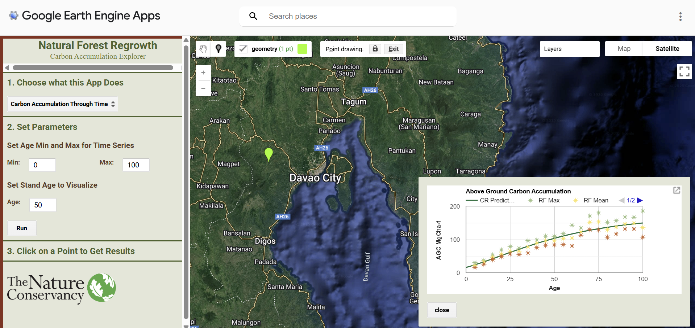

## Abstract   
RRG has partnered with the [Friends of the Usambara](https://usambaratravels.com/) to conduct Project Forest throughout the Tanga Administrative state in northeastern Tanzania. RRG and FOU have partnered to plant 10 million trees over ~6989 hectares.  

**In total, RRG estimates project activities can sequester ~ 905, 503 Mg Co2e by the year 2064.**   

## Import Libraries

```{r}
library(tidyverse)
library(patchwork)
setwd("~/scripts/rrg/r-scripts/iso")

```


## Ex-Ante Estimates of Biomass Removals
FOU will be planting secondary forests throughout degraded areas of Tanzania. [Robinson, et al.](https://www.nature.com/articles/s41558-025-02355-5) has published a global peer reviewed dataset of potential carbon removals for secondary forests. RRG is able to access this data through the Robinson, et al. [google earth engine app](https://ee-groa-carbon-accumulation.projects.earthengine.app/view/natural-forest-regeneration-carbon-accumulation-explorer) and through their [raw data](https://zenodo.org/records/15090826). 



To allow for a deeper uncertainty analysis, RRG used the parameter .tif files provided by Robinson to get parameter estimates for the prediction curves for each pixel of the project area. These estimates were then exported through this extraction script and are used to calculate estimated biomass at t with the following Chapman Richard's equation (using 1/3 as m).     

$$
y = A \left( 1 - B e^{-k t} \right)^{\frac{1}{1 - m}}
$$

where:

- $y$ = biomass (Mg C per ha at year t)
- $A$ = asymptote  
- $B$ = integration constant
- $k$ = growth rate
- $t$ = time
- $m$ = shape parameter

### Growth Curves for the Project Zone  

```{r}
#| fig-width: 14
#| fig-height: 6

df <- read.csv("csv_data/growthcurve_mindanao.csv") |>
  rename(Biomass = `CR..Prediction`) |>
  filter(age %in% c(1:40))

# fit model for function
cr <- nls(Biomass ~ a * (1 - b * exp(-k * age)) ^ (1 / (1 - 0.67)), data = df, start = c(a = 100, b = 0.5, k = 0.2))
df$PredBio <- predict(cr, df$age)
df$RemovalRate <- c(NA, diff(df$PredBio))


p1 <- df |>
  ggplot(aes(x=age)) +
  geom_point(aes(y=Biomass, color = "Biomass")) +
  geom_point(aes(y=`RF.Max`, color = "RF.Max")) +
  geom_point(aes(y=`RF.Min`, color = "RF.Min")) +
  geom_point(aes(y=PredBio, color = "Predicted Biomass")) +
  theme_bw() +
  labs(title = "Modelled aboveground carbon accumulation for Project ReGAIN", color = "", y = "Biomass MgC ha", x="Age") 

p2 <- df |>
  ggplot(aes(x=age, y=RemovalRate)) +
  geom_point() +
  geom_smooth(method = "loess", linetype = "longdash", alpha = 0.6, color = "black") + 
  theme_bw() +
  labs(title = "Annual Removal Rate for Project ReGAIN", color = "", y = "Annual Biomass MgC ha", x="Age") 

p1 + p2


```

### Project Timeline Assumptions   
RRG has worked with FOU to build forecasted schedules of project activities. These assumptions can be updated given new information, but provide timelines for modeling.

- Project Time Period: **2026-2066**    
- Planting Time Period: **2026-2029**  

Below is the projected yearly planting totals (in ha).  

| Year | Total Ha Planted |
|----------|----------|
| 2026   |  1808    |
| 2027   | 1417  |
| 2028   | 1530  |
| 2029   | 2234  |
| **Total**   | **6989**  |


For the scaling the CR function, we assume that in 2026 age = 0.     

```{r}
pef_logs <- read.csv('csv_data/pef_log.csv')
pef_logs1 <- pef_logs[-1,] |>
  mutate(pDate = ymd(End.Date.of.Planting.Event)) |>
  rename(area = 5) |>
  select(Site.Name, pDate, area) |>
  mutate(year = year(pDate)) |>
  group_by(year) |>
  summarize(total_ha = sum(area, na.rm = TRUE))

# create function for later
growth_curve <- function(age, ha) {
  biomass <- ((coef(cr)["a"] * (1 - coef(cr)["b"] * exp(-coef(cr)["k"] * age)) ^ (1 / (1-0.67)) * ha) * 44/12)
  return(biomass)
}

mega <- tibble(Year = c(2024:2064),
               Age = c(0:40),
          AreaPlanted = c(2, 173, 682.5, 643, 1000, 1000, 1000 , rep(0,34)),
          Cycle1 = growth_curve(Age, AreaPlanted[1]),
          Cycle2 = c(0, growth_curve(1:40, AreaPlanted[2])),
          Cycle3 = c(0, 0, growth_curve(1:39, AreaPlanted[3])),
          Cycle4 = c(rep(0,3), growth_curve(1:38, AreaPlanted[4])),
          Cycle5 = c(rep(0,4), growth_curve(1:37, AreaPlanted[5])),
          Cycle6 = c(rep(0,5), growth_curve(1:36, AreaPlanted[6])),
          Cycle7 = c(rep(0,6), growth_curve(1:35, AreaPlanted[7])),
          TotalRemovals = Cycle1 + Cycle2 + Cycle3 + Cycle4 + Cycle5 + Cycle6 + Cycle7)

mega_mod <- mega |>
  pivot_longer(col = Cycle1:Cycle7, names_to = "cycle", values_to = "MgC")

mega_mod |>
  ggplot(aes(x=Year, y = MgC, color = cycle)) +
  geom_point() +
  theme_bw() +
  labs(title = "Biomass Removals per Planting Cycle", y = "Mg Co2e", color = "Planting Cycle")


```

### Project Emissions      
RRG and FOU will need to collaborate to conduct a cradle-to-grave life cycle assessment (LCA) to calculate emissions for project activities in three main pools -- embodied, transportation and energy use. RRG and FOU have not conducted this analysis yet, and will employ a 20% discount rate.    

```{r}
#helper for later
discount <- function(metric, scale) {
  mass <- metric * scale
  return(mass)
}
emissions <- 0.2

```

### Leakge     
Isometric handles the leakage assessment during validation events, however it's important RRG considers leakage in removal models. For this analysis, RRG assumes a **25%** leakage rate (subject to change).   
For ex-ante estimations, leakage must be quantified in tCo2. To do this with the default 25% rate, RRG takes 25% of total Co2e removals per year.       

```{r}
leak <- 0.25

```

### Uncertainty      
RRG aims to further address uncertainty in performance through monte carlo simulation. However, for now RRG will utilize a blanket 10% uncertainty rate. In practice, RRG takes 10% of the total Co2e removals per year.    

```{r}
unc <- 0.1

```

### Performance Benchmark      
Isometric is in charge of quantifying the dynamic performance benchmark. The PB will most likely sway our estimates of MgC/ha. So, RRG will later utilize a monte carlo simulation to provide a range of performance scenarios. 

```{r}
pb <- 0

```


## Net Carbon Removals      

Simply, net removals are quantified as    

$$
Net Removals  (Mg Co2e) = (Gross Removals  (Mg Co2e) * Discount Factors) - Emissions    
$$


```{r}
#| eval: false
#| fig-width: 18
#| fig-height: 6

mega2 <- mega1 |>
  mutate(NetRemovals = ((TotalRemovals * (1 - pb) * (1 - unc)) - discount(TotalRemovals, leak)) - FertEmissions) 

mega2$RemovalRate <- c(NA, diff(mega2$NetRemovals))

p1 <- mega2 |>
  ggplot(aes(x=Year, y = NetRemovals)) +
  geom_point() +
  theme_bw() +
  labs(title = "Modeled Net C02e Accumulation for Project ReGAIN", color = "", y = "Net Mg C02e", x="Year") +
  geom_vline(xintercept=2030.5, color = "red") +
  geom_text(aes(x = 2035, y = 750000, label = "Fertilizer use ends"),size=4) +
  geom_text(aes(x = 2061, y = 730000, label = "Total Removals:\n905,543 Mg Co2e"),size=4)

p2 <- mega2 |>
  ggplot(aes(x=Year, y=RemovalRate)) +
  geom_bar(stat="identity") +
  theme_bw() +
  labs(title = "Annual Removal Rate for Project ReGAIN", y = "Annual Mg C02e Removals", x="Year") +
  annotate("segment", x = 2037, xend = 2033, y = 160000, yend = 160000, colour = "red", size=0.5, alpha=0.6, arrow=arrow()) +
  geom_text(aes(x = 2045, y = 160000, label = "Large spike when fertilizer use ends"),size=4) 

p1 + p2

```

### Model Uncertainty Analysis       
There are multiple assumptions that go into the net Co2e removals from project activities. To review, below is a table of the assumptions used in model calculations.     

**Assumptions**

| Model Input | Statistic |
|----------|----------|
| **Project Details**    |      |
| Project Size    | 6 ha     |
| Instance 2 Area     | 3000 ha     |
| **Removals**    |      |
| Growth Curves    | Max tC/ha : 89.64     |
| Total Co2e Removals   | Max tCo2e: 1,393,143     |
| **Emissions**    |      |
| Fertilizer    | 39.45 Mg Co2e/ha    |
| **Discount Rates**    |      |
| Leakage    | 25%    |
| Uncertainty    | 10%    |
| Performance Benchmark    | 0% (assuming optimal performance)    |


