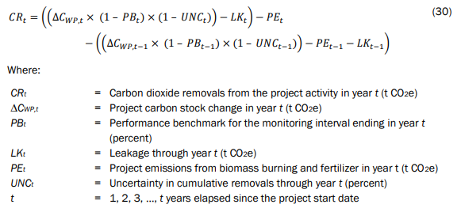

## Abstract   
RRG has partnered with the [Philippine Eagle Foundation (PEF)](https://www.philippineeaglefoundation.org/) to conduct Project ReGAIN throughout the ancestral domain of the Obu-Manuvu on Mindano Island, Philippines. RRG and PEF have partnered to plant 1.5 million trees over ~1500 hectares and is planning the expansion of ~3000 hectares.   

**In total, RRG estimates project activities can sequester ~ 905, 503 Mg Co2e by the year 2064.**   

## Import Libraries

```{r}
library(tidyverse)
library(patchwork)
setwd("~/scripts/rrg/r-scripts/iso")

```


# Ex-Ante Estimates of Biomass Removals
PEF will be planting secondary forests throughout degraded areas on Mindanao. [Robinson, et al.](https://www.nature.com/articles/s41558-025-02355-5) has published a global peer reviewed dataset of potential carbon removals for secondary forests. RRG is able to access this data through the Robinson, et al. [google earth engine app](https://ee-groa-carbon-accumulation.projects.earthengine.app/view/natural-forest-regeneration-carbon-accumulation-explorer). RRG located the project sites and exported data for the Obu-Manuvu project zone.  


RRG did not use the [raw data](https://zenodo.org/records/15090826) provided by Robinson to get prediction curves for each pixel of the project area. Instead, RRG used the growth curve provided by a single cell near the center of project activities. It's evident the highland forests of the project zone can acquire more carbon than lowland forests. However, RRG still chose a conservative estimate of roughly ~105 tC/ha at year 50 and addresses possible outcomes through simulation.      

#### Growth Curve for the Project Zone  

```{r}
#| fig-width: 14
#| fig-height: 6

df <- read.csv("csv_data/growthcurve_mindanao.csv") |>
  rename(Biomass = `CR..Prediction`) |>
  filter(age %in% c(1:40))

# fit model for function
cr <- nls(Biomass ~ a * (1 - b * exp(-k * age)) ^ (1 / (1 - 0.67)), data = df, start = c(a = 100, b = 0.5, k = 0.2))
df$PredBio <- predict(cr, df$age)
df$RemovalRate <- c(NA, diff(df$PredBio))


p1 <- df |>
  ggplot(aes(x=age)) +
  geom_point(aes(y=Biomass, color = "Biomass")) +
  geom_point(aes(y=`RF.Max`, color = "RF.Max")) +
  geom_point(aes(y=`RF.Min`, color = "RF.Min")) +
  geom_point(aes(y=PredBio, color = "Predicted Biomass")) +
  theme_bw() +
  labs(title = "Modelled aboveground carbon accumulation for Project ReGAIN", color = "", y = "Biomass MgC ha", x="Age") 

p2 <- df |>
  ggplot(aes(x=age, y=RemovalRate)) +
  geom_point() +
  geom_smooth(method = "loess", linetype = "longdash", alpha = 0.6, color = "black") + 
  theme_bw() +
  labs(title = "Annual Removal Rate for Project ReGAIN", color = "", y = "Annual Biomass MgC ha", x="Age") 

p1 + p2


```

### Assumptions   
These assumptions can be updated given new information.   
- Project Time Period: **2024-2064**    
- Planting Time Period: **2024-2030** (need schedules from PEF, [planting logs here](https://docs.google.com/spreadsheets/d/1OgfzW679wY32_994kkzQF6qOeARioZwA/edit?gid=1031012934#gid=1031012934))       


Planting will cover ~1500 ha in instance 1 and ~3000 ha in instance 2. We can break it into seven cycles:   

Three have occured:     
- **Cycle 1**: 2 ha planted throughout late 2024       
- **Cycle 2**: 173 ha planted throughout 2025  
- **Cycle 3**: 39.5 ha planted throughout 2026    

To complete instance 1 by November 2027, PEF will need to plant the remaining 1286 ha over 2026 and 2027. RRG will split the 1286 evenly for forecasts.    
- **Cycle 3**: 682.5 ha planted throughout 2026 (39.5ha + 643 ha)         
- **Cycle 4**: 643 ha planted throughout 2026    

RRG doesn't have concrete forecast schedules for instance 2 from PEF. For models, RRG assumes the ~3000 ha will be planted evenly throughout 2028, 2029 and 2030.   
- **Cycle 5**: 1000 ha planted throughout 2028            
- **Cycle 6**: 1000 ha planted throughout 2029    
- **Cycle 7**: 1000 ha planted throughout 2030    

For the scaling the CR function, we assume that in 2024 age = 0.     

```{r}
pef_logs <- read.csv('csv_data/pef_log.csv')
pef_logs1 <- pef_logs[-1,] |>
  mutate(pDate = ymd(End.Date.of.Planting.Event)) |>
  rename(area = 5) |>
  select(Site.Name, pDate, area) |>
  mutate(year = year(pDate)) |>
  group_by(year) |>
  summarize(total_ha = sum(area, na.rm = TRUE))

# create function for later
growth_curve <- function(age, ha) {
  biomass <- ((coef(cr)["a"] * (1 - coef(cr)["b"] * exp(-coef(cr)["k"] * age)) ^ (1 / (1-0.67)) * ha) * 44/12)
  return(biomass)
}

mega <- tibble(Year = c(2024:2064),
               Age = c(0:40),
          AreaPlanted = c(2, 173, 682.5, 643, 1000, 1000, 1000 , rep(0,34)),
          Cycle1 = growth_curve(Age, AreaPlanted[1]),
          Cycle2 = c(0, growth_curve(1:40, AreaPlanted[2])),
          Cycle3 = c(0, 0, growth_curve(1:39, AreaPlanted[3])),
          Cycle4 = c(rep(0,3), growth_curve(1:38, AreaPlanted[4])),
          Cycle5 = c(rep(0,4), growth_curve(1:37, AreaPlanted[5])),
          Cycle6 = c(rep(0,5), growth_curve(1:36, AreaPlanted[6])),
          Cycle7 = c(rep(0,6), growth_curve(1:35, AreaPlanted[7])),
          TotalRemovals = Cycle1 + Cycle2 + Cycle3 + Cycle4 + Cycle5 + Cycle6 + Cycle7)

mega_mod <- mega |>
  pivot_longer(col = Cycle1:Cycle7, names_to = "cycle", values_to = "MgC")

mega_mod |>
  ggplot(aes(x=Year, y = MgC, color = cycle)) +
  geom_point() +
  theme_bw() +
  labs(title = "Biomass Removals per Planting Cycle", y = "Mg Co2e", color = "Planting Cycle")


```

## Project Emissions      

### Fertilizer Use      
PEF will be utilizing four distinct fertilizers to prep sites and ensure strong saplings. All fertilizers will be made by PEF from natural waste found throughout the nursery areas.     
It is expected that PEF will utilize these fertilizers from years 1-3 for each project instance. However, PEF will monitor and track their fertilizer use.     
[Attached here](https://docs.google.com/document/d/1Z5JtSc4RT0DZXd64uHlfG_oOwWxp9t6h8AvUT48b8ZU/edit?tab=t.0) is the documentation for how RRG quantified fertilizer use including each fertilizer description.     

**Assumptions**   
For these models, RRG is using the Verra protocol, however RRG will need to update them based on the Isometric protocol. Using the Verra protocol, RRG estimates ferilizer emissions to be **39.45 Mg Co2e** per hectare assuming an average planting density of ~2,000 trees per hectare.    
RRG will scale 39.45 by hectares in production from **2024-2030** for total Co2e emissions.    

```{r}
fert <- 39.45

mega1 <- mega |>
  mutate(AreaProduction = cumsum(AreaPlanted),
  FertEmissions = AreaProduction * fert)

# assuming emissions stop after 2030
mega1$FertEmissions[mega1$Year > 2030] <- 0

```


### Leakge     
Mindanao Island has available data regarding historical grower records and illegal logging rates. However, there is no data available for the Obu-Manuvu people. RRG can see from remote sensing that farms throughout the project zone are quite small and are believed to be subsistence farms.   
Moving into the future, RRG and PEF will complete the FPIC process and hold local farmer interviews to determine foregone production within the project area. Project activities will not displace any farms within the project area. PEF aims to mitigate leakage into the surrounding region by employing these farmers and providing them with an alternate, sustainable livelihood.   
Isometric handles the leakage assessment during validation events, however it's important RRG considers leakage in removal models. For this analysis, RRG assumes a **25%** leakage rate (subject to change).   
For ex-ante estimations, leakage must be quantified in tCo2. To do this with the default 25% rate, RRG takes 25% of total Co2e removals per year.       

```{r}
#helper for later
discount <- function(metric, scale) {
  mass <- metric * scale
  return(mass)
}

leak <- 0.25

```

### Uncertainty      
RRG aims to further address uncertainty in performance through monte carlo simulation. However, for now RRG will utilize a blanket 10% uncertainty rate. In practice, RRG takes 10% of the total Co2e removals per year.    

```{r}
unc <- 0.1

```

### Performance Benchmark      
Isometric is in charge of quantifying the dynamic performance benchmark. The PB will most likely sway our estimates of MgC/ha. So, RRG will utilize monte carlo simulation to provide a range of performance scenarios. 

```{r}
pb <- 0

```


## Net Carbon Removals      
For now, RRG is following the net carbon removals equation provided by Verra. RRG will soon transfer methodologies to Isometric. Below is the Verra equation to calculate net carbon removals.     

    


Simply, net removals are quantified as    

$$
Net Removals  (Mg Co2e) = (Gross Removals  (Mg Co2e) * Discount Factors) - Emissions    
$$


```{r}
#| fig-width: 18
#| fig-height: 6

mega2 <- mega1 |>
  mutate(NetRemovals = ((TotalRemovals * (1 - pb) * (1 - unc)) - discount(TotalRemovals, leak)) - FertEmissions) 

mega2$RemovalRate <- c(NA, diff(mega2$NetRemovals))

p1 <- mega2 |>
  ggplot(aes(x=Year, y = NetRemovals)) +
  geom_point() +
  theme_bw() +
  labs(title = "Modeled Net C02e Accumulation for Project ReGAIN", color = "", y = "Net Mg C02e", x="Year") +
  geom_vline(xintercept=2030.5, color = "red") +
  geom_text(aes(x = 2035, y = 750000, label = "Fertilizer use ends"),size=4) +
  geom_text(aes(x = 2061, y = 730000, label = "Total Removals:\n905,543 Mg Co2e"),size=4)

p2 <- mega2 |>
  ggplot(aes(x=Year, y=RemovalRate)) +
  geom_bar(stat="identity") +
  theme_bw() +
  labs(title = "Annual Removal Rate for Project ReGAIN", y = "Annual Mg C02e Removals", x="Year") +
  annotate("segment", x = 2037, xend = 2033, y = 160000, yend = 160000, colour = "red", size=0.5, alpha=0.6, arrow=arrow()) +
  geom_text(aes(x = 2045, y = 160000, label = "Large spike when fertilizer use ends"),size=4) 

p1 + p2

```

### Model Leverage Points   
There are multiple assumptions that go into the net Co2e removals from project activities. To review, below is a table of the assumptions used in model calculations.     

**Assumptions**

| Model Input | Statistic |
|----------|----------|
| **Project Details**    |      |
| Instance 1 Area    | 1500 ha     |
| Instance 2 Area     | 3000 ha     |
| **Removals**    |      |
| Growth Curves    | Max tC/ha : 89.64     |
| Total Co2e Removals   | Max tCo2e: 1,393,143     |
| **Emissions**    |      |
| Fertilizer    | 39.45 Mg Co2e/ha    |
| **Discount Rates**    |      |
| Leakage    | 25%    |
| Uncertainty    | 10%    |
| Performance Benchmark    | 0% (assuming optimal performance)    |


**Next Steps**    
- Integrate Isometric protocols   
- Simulate a range of scenarios involving gross removals, discount factors and emissions.   


